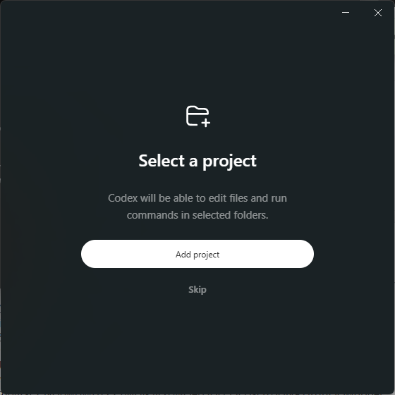
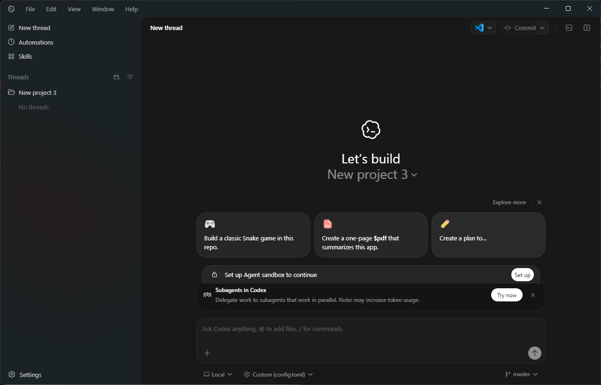
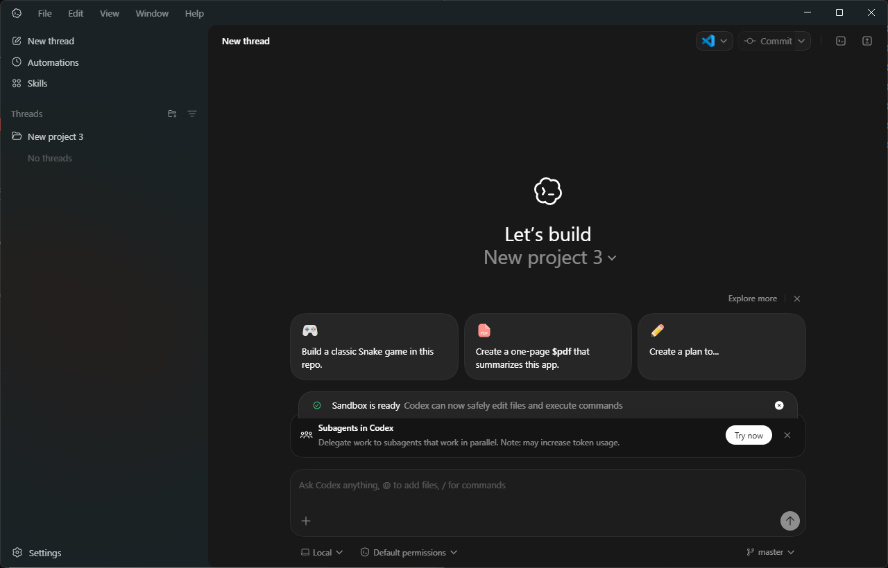
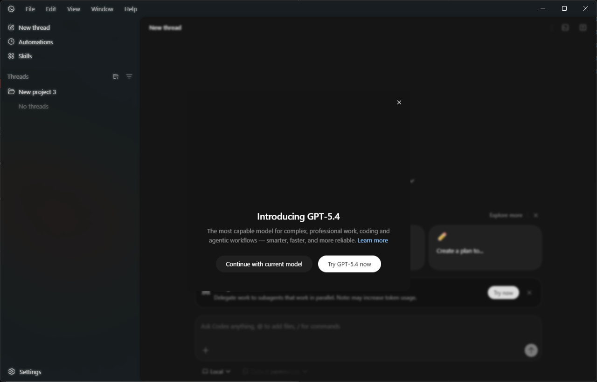

# codex-win

## Codex GUI Windows Installer

This repository provides a Windows installer workflow for Codex GUI against the Oracle local endpoint profile.

## Files

- `codex-gui-installer.cmd`: Core installer/update script (menu + direct action mode).
- `codex-gui-frontend.ps1`: Windows Forms frontend with action buttons.
- `codex-gui-frontend.cmd`: Double-click launcher for the PowerShell frontend.

## Frontend Runtime Behavior

- The frontend can run even when launched from a temporary extraction context.
- If codex-gui-installer.cmd is not found beside the frontend script, the frontend searches common locations (current folder, Downloads, and %TEMP%) and can recover from a codex-win*.zip/main.zip by extracting to %TEMP%.
- The installer script is staged to %TEMP%\codex-win-runtime before action execution.
- codex-gui-frontend.cmd launches the GUI in a separate hidden PowerShell process and exits, so the initial command window closes while the GUI remains open.
- When an action requires elevation and opens a new administrator console, the original non-elevated action window closes automatically.

## Behavior

### Install

1. Installs prerequisites with winget:
   - `Git.Git`
   - `OpenJS.NodeJS.LTS`
   - `Python.Python.3.14`
   - `Microsoft.DotNet.SDK.10`
2. Installs Codex from Microsoft Store via winget:
   - `winget install --id 9PLM9XGG6VKS -e ...`
3. Creates `%USERPROFILE%\.codex`.
4. Writes `%USERPROFILE%\.codex\config.toml` with the standard OCA configuration template.
5. Checks API portal endpoint connectivity for Oracle VPN access.
6. If the endpoint check fails, shows `You must connect to the Oracle VPN before obtaining the API key.` and waits for a keypress before retrying.
7. Opens browser to API key portal:
   - `https://apex.oraclecorp.com/pls/apex/r/oca/api-key/home`
8. Prompts for API key and updates both:
   - `%USERPROFILE%\.codex\config.toml` (`api_key = "..."`)
   - `%USERPROFILE%\.codex\auth.json`:
     - `{"auth_mode":"apikey","OPENAI_API_KEY":"..."}`

### Reinstall

1. Uninstalls Codex with winget.
2. Removes `%USERPROFILE%\.codex`.
3. Runs full `Install` flow.

### Uninstall

1. Uninstalls Codex with winget.
2. Removes `%USERPROFILE%\.codex`.

### Update API Key

1. Checks API portal endpoint connectivity for Oracle VPN access.
2. If the endpoint check fails, shows `You must connect to the Oracle VPN before obtaining the API key.` and waits for a keypress before retrying.
3. Opens browser to the API key portal.
4. Prompts for API key.
5. Updates both `%USERPROFILE%\.codex\config.toml` and `%USERPROFILE%\.codex\auth.json`.
6. If config is missing, shows an error and asks user to run Install first.

## Download (No GitHub Experience Needed)

1. Open the repository page in your browser.
2. Click the green `Code` button near the top right.
3. Click `Download ZIP`.
4. Open your Downloads folder and extract the ZIP file.
5. Open the extracted folder (for example `codex-win-main`).
6. Run `codex-gui-frontend.cmd` for the button-based UI, or run `codex-gui-installer.cmd` for the menu-based installer.

## Usage

### Menu Mode (Existing)

Run from Command Prompt on Windows:

```bat
codex-gui-installer.cmd
```

Then choose:

- `1` for Install
- `2` for Reinstall
- `3` for Uninstall
- `4` for Update API Key
- `Q` to quit

### Frontend (New)

Run either:

```bat
codex-gui-frontend.cmd
```

or:

```powershell
powershell -NoProfile -ExecutionPolicy Bypass -File .\codex-gui-frontend.ps1
```

The frontend opens a small GUI with buttons for Install, Reinstall, Uninstall, and Update API Key. Each action launches in its own console window.

### First Launch Walkthrough (After Installation)

1. Open Codex GUI and select your project folder.



2. In the thread view, click `Set up` when prompted to set up the Agent sandbox.



3. Wait for the `Sandbox is ready` status banner.



4. If the model intro appears, choose your preferred option (for example, continue with current model).



### Direct Action Mode (for automation/frontend)

```bat
codex-gui-installer.cmd --action install
codex-gui-installer.cmd --action reinstall
codex-gui-installer.cmd --action uninstall
codex-gui-installer.cmd --action update-api-key
```

## Notes

- Install commands use winget with:
  - `-h`
  - `--accept-source-agreements`
  - `--accept-package-agreements`
  - `--disable-interactivity`
- Uninstall uses winget with:
  - `-h`
  - `--disable-interactivity`
- The script self-elevates once at startup to reduce repeated UAC prompts during install/uninstall actions, while preserving the original user profile path for `.codex` updates.
- Config and auth files are written as UTF-8 without BOM for Codex parser compatibility.
- If Codex is already absent during uninstall, the script continues and still removes `.codex` if present.
